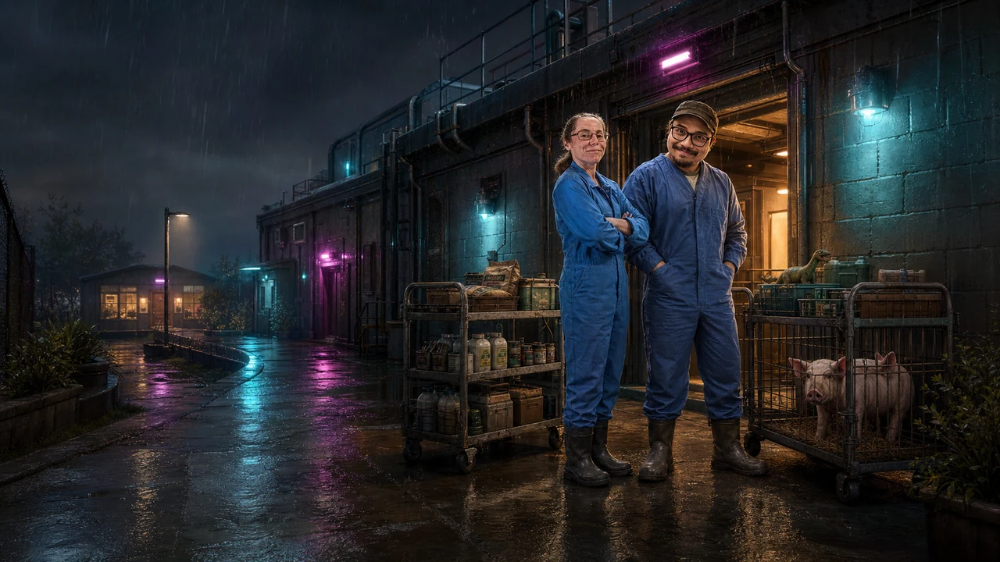

# Busy Day at the Viv V2

`Busy Day at the Viv V2` is a retro-noir browser adventure about completing one professionally chaotic animal-facility shift. Choose Mel or Josh, feed three groups of animals, support a pig procedure, negotiate a rain-soaked car park, survive Ross's “quick question”, and earn the coffee Juan promised at 06:45.

V2 is a modular Vite, TypeScript, and Phaser 3 project. The original single-file game remains preserved as `Busy_Day_v1.html`.

> **Production status:** GitHub Pages currently serves the merged V2.0 baseline from `main` at [`54499b3`](https://github.com/nacho-android/busy_day/commit/54499b368d566f3fa4e7da1af3e7a06ed1942b2f). V2.1 implementation head [`61cfdb8`](https://github.com/nacho-android/busy_day/commit/61cfdb8df7df211af7ed7d0516865ef596114dd0) passed clean PR workflow [`29348227739`](https://github.com/nacho-android/busy_day/actions/runs/29348227739): static/unit/build, 48/48 dev-server tests, and 6/6 previews. Pages skipped as designed; V2.1 is not described as deployed until PR #2 merges and its main workflow, Pages deployment, and hosted smoke pass. Public-control Mel/Josh completion, physical-device/controller, audio-listening, screen-reader, soak/current-phone-performance, and rights-review gates remain open.



## What is included

- Ten connected locations: Tea Room, Main Hallway, Feed Store, Pig Housing, Sheep & Scales, Baboon Wing, Procedure Prep, Cath Lab, Car Park, and Coffee Shop.
- Eighteen sequential objectives and 31 targets: V1's story spine plus new route-control, baboon-interlock, and cath-monitor complications.
- Two playable leads with different speed, stamina, carrying, stress, and interaction characteristics.
- Smooth accelerated movement, sprinting, dodge, data-defined collision footprints, perspective scaling, depth/foreground occlusion, hold-to-use interactions, locked exits, and faded scene transitions.
- Branching Wayne dialogue, Ross and Thanh hazards, health/Wayne failure states, checkpoints, restart, and S–D ending ranks.
- Versioned local save/continue, settings, profile history, and malformed-save recovery.
- Responsive DOM interface with keyboard, touch, and gamepad input paths; landscape prompt; safe-area support; captions; larger text; high contrast; reduced motion; handedness; and Relaxed Shift.
- Eleven original generated retro-noir images: one title and a backplate for every gameplay location. All runtime exports are 1280×720 WebP files; their exact combined size is 1,818,586 bytes (1.734 MiB), while all 1672×941 masters remain available for revision.
- Eight generated retro-noir dialogue portraits for Mel, Josh, Sally, Juan, Alan, Dhanya, Ross, and Wayne, with accessible initials fallbacks for the wider cast.
- Twenty-six original procedurally synthesized music/SFX files.

The detailed V1 evidence is in [`docs/V1_AUDIT.md`](docs/V1_AUDIT.md). The implementation-aligned design is in [`docs/V2_GAME_DESIGN.md`](docs/V2_GAME_DESIGN.md).

## Requirements

- Node.js 24 or newer (active LTS)
- npm 10 or newer (the lockfile was produced with npm 11)
- A current desktop or mobile browser with Canvas/WebGL, Web Audio, ES2022 modules, and local storage. Chromium/Firefox use automatic renderer selection; Safari and all iOS browsers use Phaser Canvas to avoid WebKit context-reclamation failures.

## Install and run

```powershell
npm ci
npm run dev
```

Vite prints the local URL. The development server binds to `127.0.0.1`; it is not exposed to the local network by default.

To run the historical V1, serve the repository with any static HTTP server and open `Busy_Day_v1.html`. Do not replace or rewrite that file.

## Commands

| Command | Purpose |
| --- | --- |
| `npm run dev` | Start the Vite development server on `127.0.0.1` |
| `npm run typecheck` | Run strict TypeScript project checks |
| `npm run lint` | Lint source, tests, scripts, and configuration |
| `npm test` | Run the Vitest unit suite once |
| `npm run test:watch` | Run unit tests in watch mode |
| `npm run test:e2e` | Run configured Playwright projects for Chromium, Firefox, and WebKit |
| `npm run test:e2e:chromium` | Run only the Chromium Playwright project |
| `npm run test:e2e:preview` | Build and test the production bundle through Vite Preview |
| `npm run test:e2e:public` | Run the opt-in, ordinary-input Mel/Josh public journey harness |
| `npm run qa:performance` | Sample a production preview on `127.0.0.1:4176`: navigation, frame pacing, transfer, renderer, and Chromium heap |
| `npm run verify:release` | Check V1 preservation, manifests, runtime assets, release exclusions, links, and selected credential patterns |
| `python scripts/verify_audio.py` | Validate all generated WAV headers, levels, and loop edges |
| `npm run qa:visual` | Capture the current visual-QA checkpoint set for human inspection |
| `npm run build` | Type-check and create the production bundle in `dist/` |
| `npm run preview` | Serve `dist/` locally through Vite Preview |
| `npm run assets:optimize` | Regenerate all 11 browser-ready 1280×720 WebP files from the retained PNG masters |

Playwright browser binaries are not installed by `npm ci`. Before the first E2E run, install the required local browser runtimes:

```powershell
npx playwright install chromium firefox webkit
```

The command may download several hundred megabytes. On Linux CI, Playwright's documented system dependencies may also be required.

## Controls

### Desktop

| Action | Control |
| --- | --- |
| Move | `WASD` or arrow keys |
| Sprint | Hold `Shift` |
| Interact / talk / operate | Hold `E` until the action ring completes |
| Dodge / escape Ross | `Space` |
| Objectives and hint | `O` or the objective button |
| Pause | `P`, `Escape`, or the pause button |
| Mute | `M` |
| Advance dialogue | `Enter`, `Space`, `E`, or the on-screen button |
| Choose a dialogue response | Number key or the response button |

### Touch

Use the virtual joystick to move and the **Sprint**, **Dodge**, and contextual **Use/Talk/Operate** buttons for actions. Touch layout can be swapped between right- and left-handed arrangements in Settings. The game is designed for landscape; a portrait overlay pauses the live scene without resetting the run.

### Gamepad

The left stick moves. Standard buttons 0, 1, and 2 map to world interaction, sprint, and dodge; D-pad/stick directions move menu focus, button 0 accepts, button 1 goes back, and Start pauses. This path covers the title, dialogue and choices, settings, objective drawer, pause/confirmation, failure, and ending overlays. Exact face-button labels vary by controller/browser. A synthetic Chromium gamepad test covers title selection, opening dialogue, pause, and resume, but no physical controller/browser matrix has been recorded.

## Save, continue, and reset

V2 stores one active run, settings, and profile bests in local storage under `busy_day_at_the_viv_v2_save`. The current envelope is schema version 3 and is separate from V1 data. Schema-two progress is migrated by stable objective IDs across the three new V2.1 tasks. A newer, unknown schema keeps portable preferences/profile data but safely drops incompatible active progress instead of silently downgrading it.

- **Continue** appears when an unfinished V2 run is available.
- Objective completion, scene transitions, settings changes, periodic movement snapshots, and page-backgrounding persist the current run.
- **Retry checkpoint** rolls objectives, targets, flags, rewards, location, and meters back to the latest authored checkpoint.
- **Restart shift** preserves profile/settings and starts the chosen lead again at 06:45.
- **Reset saved progress** is in Settings and requires confirmation. It clears the V2 active run, profile, and preferences on that browser only.

Private browsing or storage restrictions can prevent persistence; gameplay continues in memory. Movement is saved on a throttled interval rather than on every rendered frame.

## Accessibility and mobile notes

- Important warnings use visible captions/toasts as well as sound.
- Typewriter text can be disabled; reduced motion also reveals dialogue immediately and shortens scene fades.
- High-contrast UI and a larger text option are available.
- Music, SFX, and master mute are saved.
- Touch controls respect safe-area insets, pointer cancellation, and handedness.
- The page disables scrolling and gameplay-area touch gestures.
- Relaxed Shift reduces car impact, Ross duration, and Wayne pressure.

These features are implemented and their automated browser checks cover representative viewports and touch/controller paths. That is not a substitute for physical touch devices, hardware controllers, or a screen-reader pass, which remain release gates.

## Architecture and content editing

The runtime separates authored definitions from game/state code:

- `src/data/locations.ts` — locations, spawns, exits, obstacles, interactions, NPC placement/patrols, foreground crops, music, and perspective
- `src/data/story.ts` — objective order, dialogue, rewards, flags, and checkpoints
- `src/data/characters.ts` — gameplay statistics plus independently replaceable renderer, asset, animation, footprint, portrait, and voice definitions
- `src/state/` — save parsing/persistence and the authoritative run-state service
- `src/scenes/` — Phaser boot, preload, title, location, UI, and ending scenes
- `src/ui/GameUI.ts` — DOM menus, HUD, dialogue, touch input, settings, and accessibility state
- `src/systems/` — collision and world-graph validation
- `src/audio/AudioDirector.ts` — music/SFX lookup and playback

See [`docs/ARCHITECTURE.md`](docs/ARCHITECTURE.md) for state flow, invariants, and replacement workflows.

## Assets, audio, and rights

- Runtime backplates are in `public/assets/backgrounds/`; all 11 are optimized 1280×720 WebP files totaling 1,818,586 bytes (1.734 MiB). Only title/Tea Room decode up front; later locations load on entry into a three-room LRU. All 11 editable 1672×941 PNG masters remain in `art/generated-masters/`.
- Principal dialogue portraits are optimized 384×384 WebPs in `public/assets/portraits/`; the 2048×1024 generated contact-sheet master remains in `art/generated-masters/`.
- `art/generated-sources/mel_josh_directional_atlas_source.png` is a retained, non-runtime directional character source. It is not declared as a packed or approved animation atlas; current in-world characters deliberately use the data-driven vector renderer.
- Original audio is in `public/assets/audio/` and can be regenerated deterministically with `scripts/generate_audio.py`.
- [`docs/ASSET_MANIFEST.md`](docs/ASSET_MANIFEST.md) records supplied references, hashes, visual findings, generated-art provenance, and replacement notes.
- [`docs/REFERENCE_INVENTORY.json`](docs/REFERENCE_INVENTORY.json) is the machine-readable catalogue of the 43 local-only supplied references.
- [`docs/AUDIO_MANIFEST.md`](docs/AUDIO_MANIFEST.md) records the method, format, duration, loop behaviour, and licence of every audio file.

The supplied photographs and `style_ref.png` are source references, not runtime assets and not automatically licensed for redistribution. They remain only in the local workspace and are intentionally excluded from the published GitHub repository; the manifests retain their catalogue and hashes. Some generated artwork is likeness-derived. Confirm consent and publication rights or replace affected art before a public release. The repository [`LICENSE`](LICENSE) explains the different code, audio, generated-art, and reference-image scopes.

## Credits and generation notes

- Story premise, characters, jokes, and the original playable implementation come from the supplied `Busy_Day_v1.html`; the factual lineage is recorded in the V1 audit.
- V2 is built with Phaser, Vite, TypeScript, Vitest, Playwright, ESLint, and Sharp. Those projects retain their own licences.
- The scene and portrait masters were created for this project with OpenAI image generation using the references recorded in the asset manifest. Runtime files are generated derivatives, not raw reference photographs.
- Music and sound effects were composed as deterministic mathematical synthesis by `scripts/generate_audio.py`; no recordings, commercial soundtrack, or sample library is used.
- The creators and publication permissions of the supplied reference photographs are not established by the workspace. The project does not invent attribution or imply consent where it has not been documented.

## Production build and deployment

```powershell
npm ci
npm run typecheck
npm run lint
npm test
npm run build
npm run preview
```

Deploy the contents of `dist/` to a static host. Vite uses a relative base by default; audio uses `import.meta.env.BASE_URL`, and Vite rewrites processed CSS image URLs. For this repository's GitHub Pages path, build with `VITE_BASE_PATH=/busy_day/`. Both build forms passed locally for V2.1, and PR workflow [`29348227739`](https://github.com/nacho-android/busy_day/actions/runs/29348227739) repeated the production build after a clean `npm ci`.

V2.1 PR workflow [`29348227739`](https://github.com/nacho-android/busy_day/actions/runs/29348227739) passed its clean static/unit/build gate and 48/48 dev-server plus 6/6 built-preview browser tests: 16+2 in each of Chromium, Firefox, and WebKit. Pages correctly skipped on the PR branch. The currently deployed V2.0 baseline remains separately backed by main workflow `29298026940`, cache-busted hosted asset checks, and title → New Shift → refresh → Continue smoke with zero captured warning/error logs; V2.1 deployment evidence is recorded only after merge. Remaining non-CI limits are in [`docs/KNOWN_LIMITATIONS.md`](docs/KNOWN_LIMITATIONS.md).

Do not deploy `node_modules/`, browser/test reports, local `.env` files, reference photographs without confirmed rights, or browser/session data.

The public project is [`nacho-android/busy_day`](https://github.com/nacho-android/busy_day). [PR #1](https://github.com/nacho-android/busy_day/pull/1) merged the deployed V2.0 baseline to `main` as `54499b368d566f3fa4e7da1af3e7a06ed1942b2f`; Pages deployment `5433749633` reports that SHA, ref `main`, and state `success`. Pages uses workflow build type, HTTPS, and a main-only deployment policy; the workflow builds with `VITE_BASE_PATH=/busy_day/`. The V2.1 release verifier passes at 141 intended files / 50.27 MiB after exclusions, all 43 private references excluded, the V1 hash preserved, and no selected high-risk credential-pattern match.

## Documentation

- [`docs/V1_AUDIT.md`](docs/V1_AUDIT.md) — factual V1 review and preservation hash
- [`docs/V2_GAME_DESIGN.md`](docs/V2_GAME_DESIGN.md) — implemented V2 design and scope decisions
- [`docs/ASSET_MANIFEST.md`](docs/ASSET_MANIFEST.md) — image catalogue and art provenance
- [`docs/REFERENCE_INVENTORY.json`](docs/REFERENCE_INVENTORY.json) — machine-readable inventory of excluded local reference files
- [`docs/AUDIO_MANIFEST.md`](docs/AUDIO_MANIFEST.md) — audio catalogue and provenance
- [`docs/ARCHITECTURE.md`](docs/ARCHITECTURE.md) — runtime and data architecture
- [`docs/IMPLEMENTATION_CHECKLIST.md`](docs/IMPLEMENTATION_CHECKLIST.md) — evidence-based completion/release gates
- [`docs/KNOWN_LIMITATIONS.md`](docs/KNOWN_LIMITATIONS.md) — genuine remaining limitations and user impact
- [`docs/RELEASE_RUNBOOK.md`](docs/RELEASE_RUNBOOK.md) — clean-checkout, validation, publication, and Pages sign-off procedure
- [`CHANGELOG.md`](CHANGELOG.md) — release history

## Contributing

Keep `Busy_Day_v1.html` byte-for-byte preserved. Update the relevant manifest whenever replacing artwork or audio, run the static/unit gates before committing, and do not add credentials, cookies, tokens, private browser data, unlicensed third-party assets, or incidental personal information.
