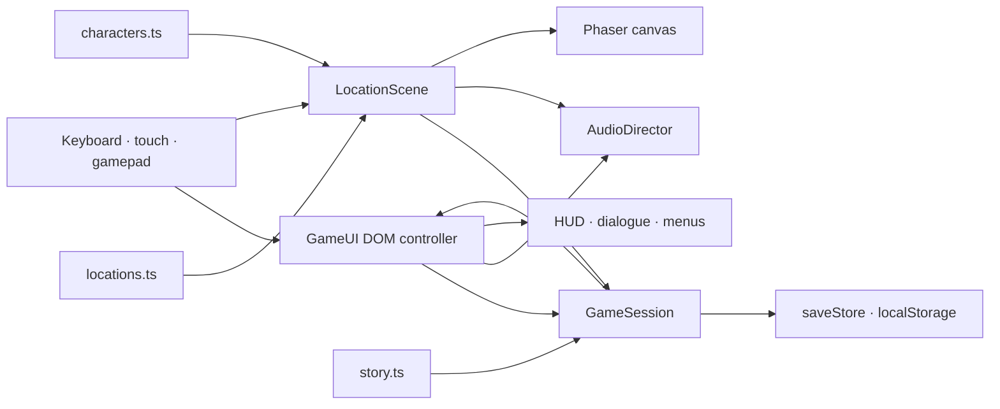

# Busy Day at the Viv V2 — Architecture

**Status:** implementation-aligned snapshot, 2026-07-14
**Runtime:** Vite 8 · TypeScript 6 (strict) · Phaser 3.90 · DOM/CSS interface

## Design priorities

The V2 codebase keeps the story and content definitions replaceable without returning to V1's single large HTML/script file. Authoritative run state lives in one service; Phaser owns the world canvas; the DOM owns menus, dialogue, accessibility presentation, and touch input. Location, character, objective, and save definitions are typed and validated before a shift starts.

The implementation deliberately uses a single generic `LocationScene` for all ten areas. Adding a room usually means adding data and art rather than copying scene logic.



## Startup and scene lifecycle

`src/main.ts` is the composition root. It creates one 1280×720 Phaser game using FIT scaling, four active input pointers, gamepad input, and a 60 fps target.

The registered scene order is:

1. In development, `BootScene` runs `validateWorldGraph()` and stops with a readable diagnostic for invalid authored data. Unit/release gates run the same exhaustive validator; production skips its collision-grid search to avoid a startup long task.
2. `PreloadScene` shows DOM loading progress and loads the title and Tea Room backplates plus portrait assets from typed manifests. A required-image failure stops scene startup.
3. `TitleScene` renders the generated title backplate and hands menus to `GameUI`.
4. `LocationScene` lazy-loads an unvisited room's backplate with two transient retries and title/Continue recovery, renders the current location from `RunState`, and manages a three-location decoded-background LRU alongside obstacles, interactions, NPCs, character, collision, movement, hazards, exits, and music.
5. `UIScene` refreshes the DOM HUD at 10 Hz while the location scene is active.
6. `EndingScene` is registered as an ending surface; the current completion path presents the DOM ending from `LocationScene` after final dialogue.

Scene transitions update `GameSession` first, then restart `LocationScene` at a named destination spawn. A transition lock and 750 ms entry cooldown prevent held movement from immediately bouncing through a reciprocal exit.

## Data model

### Locations

`src/data/locations.ts` exports one `LocationDefinition` per `LocationId`. Each definition contains:

- stable location ID, display name, theme, music cue, optional generated background key;
- a rectangular walkable bound;
- named spawn points with facing;
- exit rectangles with destination location/spawn and optional required flag;
- rectangular fixed obstacles;
- interactions with verb, radius, hold duration, prerequisite, response, and prop type;
- NPC placement, identity, role, line, and visual ID;
- perspective interpolation values.

`validateWorldGraph()` checks duplicate spawn/interaction/objective IDs; ordered, acyclic objective/flag dependencies; target rooms; route unlocks at every objective; destination spawns and unique reciprocal exits; dialogue/portrait/effect identities; background/music/character references; collision-safe grid approaches for every spawn, interaction, NPC, and exit; and direct, collision-safe moving-NPC patrol segments. Unit tests inject malformed graphs to prove each class of failure. The grid proof is conservative static geometry validation, not a replay of transient Phaser hazards.

After final-art geometry alignment, a radius-22, 5-pixel-grid audit passed every spawn, target, NPC and exit across the world. The validator found and prompted the move of Vu's unreachable Feed Store position. Integrated all-room visual QA and the focused three-engine reciprocal route supplement this static result. The V2.1 Chromium hardening suite crossed all 18 authored exit directions with real keyboard movement after collision-safe approach setup and asserted destination, named spawn, facing, and neutral-input stability; repeat that suite in the final three-engine workflow before release.

### Story and objectives

`src/data/story.ts` defines the ordered 18-objective/31-target route. An `ObjectiveDefinition` supplies its act, copy, hint, target IDs, rewards, granted flags, kit labels, and checkpoint status. `GameSession.interact()` is the authoritative objective reducer: it enforces interaction prerequisites, records a target once, grants rewards/flags, advances the objective, updates level, and finishes the profile.

Dialogue content is represented as short `DialogueLine` arrays. Choices carry a small typed effect vocabulary (`wayneDown`, `wayneUp`, or `stressDown`) that `GameUI` applies. Most NPC lines are currently single unconditional lines stored with the location.

### Characters

`src/data/characters.ts` separates `CharacterDefinition` gameplay statistics from `CharacterVisualDefinition`. Mel and Josh have independent movement, sprint, stamina, interaction, carrying, and stress values. All named visuals are keyed independently from gameplay logic.

`CharacterVisualDefinition` is a complete rendering contract: renderer mode, image/atlas references, frame layout, named idle/walk-four-directions/interaction/contextual/hit animations and timing, vector appearance, origin/scale, collision footprint, portrait expressions, and voice metadata. `CharacterRig` executes vector-paper-doll, sprite-sheet, or texture-atlas modes. The current in-world presentation deliberately uses the animated vector mode; changing sheets, portraits, timing, collider, or voice does not require objective/gameplay changes.

## Runtime state and persistence

`GameSession` owns the active `RunState`, settings, and profile. Other systems request transitions, interactions, meter updates, failures, retries, settings changes, and resets through its methods instead of mutating browser globals.

The development/test build exposes a frozen `window.__busyDayTest` adapter for controlled E2E state inspection, objective-room travel, target completion, and physical exit approach. Production builds do not create it.

`src/state/saveStore.ts` serializes one `SaveEnvelope` to `busy_day_at_the_viv_v2_save`:

```text
schemaVersion: 3
settings: audio · dialogue · motion · contrast · subtitles · text · handedness · relaxed
profile: best rank · best coins · completed runs
activeRun: lead · location/spawn/position · objective/targets/flags · meters · rewards · checkpoint · failure
```

Parsing treats browser data as untrusted. It clamps numeric values, verifies lead/location/spawn shape, derives the coherent completed-objective prefix, targets, flags, rewards, level, and checkpoint, supplies setting defaults, and discards structurally incomplete active runs. Schema-two objective indices are migrated through the stable legacy ID table so the three V2.1 insertions resume coherently; older envelopes normalize through the same current schema. Envelopes from a future unknown schema preserve portable settings/profile values but discard incompatible active progress instead of being rewritten as schema three.

`GameSession` persists on new game, objective interactions, transitions, settings changes, failure, retry, reset, a 1.2-second movement interval, and page backgrounding. The interval avoids a local-storage write on every rendered frame while keeping refresh recovery close to the current position.

## Movement, collision, and presentation

`moveCircle()` in `src/systems/collision.ts` is a framework-independent kinematic resolver. It divides a movement delta into steps of at most seven world units, keeps the selected lead’s data-defined footprint inside location bounds, rejects expanded obstacle rectangles, and resolves X/Y separately to permit wall sliding. Authored acceleration/deceleration is applied before resolution and actual resolved velocity drives animation. Dodge uses the same resolver, preventing a 74-unit dodge from tunnelling through authored barriers.

This is direct-input movement, not pathfinding. The implementation has no navmesh, A*, pointer-to-walk, polygon collision, or carried-object footprint. The pig trolley state applies the selected lead's carrying speed factor; it does not attach a separate physical body to the player.

Every current location definition has a generated `backgroundKey`. All 11 runtime backgrounds are 1280×720 WebP files totaling 1,818,586 bytes (1.734 MiB); all 1672×941 PNG masters remain outside the runtime path. Preload decodes only title/Tea Room, then LocationScene loads backgrounds on entry and retains a three-location LRU, reducing the normal decoded backplate ceiling from eleven textures to roughly four including title. Browser HTTP caching still avoids repeated network cost. `BackdropRenderer` retains deterministic procedural fallback for missing definitions, but production rooms use generated art. Data-defined crops duplicate matching generated-background pixels at foreground depth so actors pass behind visible rails/carts/fixtures. Seven NPCs patrol authored waypoints and react to proximity.

Feed Store, Sheep & Scales, Baboon Wing, Procedure Prep, and Coffee Shop collision/exit geometry was revised with their final backplates to follow visible doors, counters, cages, scales, rails, carts, and other fixtures. Static reachability passes across the whole world. The real Tea Room → Main Hall → Feed Store → Main Hall route passes in Chromium, Firefox, and WebKit using data-driven spawn coordinates. Integrated visual QA also captured every room plus the ending without console/page errors, and the contact sheet passed review. Focused V2.1 Chromium groups subsequently crossed all 18 authored directions; the expanded final three-engine workflow is still required.

## UI and input ownership

`src/ui/GameUI.ts` owns all HTML overlays declared in `index.html`:

- title/lead selection and Continue;
- HUD and condition meters;
- objective list, kit flags, and hint;
- range prompt and hold progress;
- dialogue, typewriter reveal, and choices;
- pause, settings, confirmation, failure, and ending;
- touch joystick/actions, captions, toasts, and portrait orientation prompt.

`GameUI` is the single world-input aggregator for touch, DOM keyboard, and privacy-safe polled gamepad state and exposes an `InputSnapshot` to `LocationScene`. Blocking overlays clear held keyboard/touch state and pause/resume the location scene through a reason set, avoiding nested-menu resume and stuck-key bugs. The same poller edge-detects D-pad/stick focus, accept, back and Start/pause across title, dialogue/choices, settings, objectives, pause/confirm, failure and ending overlays. A synthetic Chromium gamepad test covers title selection, opening dialogue, pause and resume; physical controllers and disconnect/reconnect remain manual validation.

The layout uses CSS safe-area variables, dynamic viewport units, visible focus styles, minimum touch controls larger than 44 CSS pixels, a coarse-pointer layout, and a portrait media query. Settings become body classes for large text, contrast, reduced motion, and handedness.

## Audio

`AudioDirector` has two user-facing gain categories: music and SFX. Six loop IDs map to original WAV beds and 20 one-shot cues map to UI, interactions, animals, machinery, transitions, and hazards. It uses `HTMLAudioElement`, waits for an activation event, crossfades music, ducks it under dialogue/pause, and reapplies saved volume/mute settings.

Music is requested by location rather than predecoded at boot. One-shots are instantiated when used. There are no separate ambience/UI buses, spatial panning, or compressed Opus mirrors yet. Audio paths use `import.meta.env.BASE_URL`, and Vite rewrites the processed CSS title URL for relative/subpath builds.

## Asset pipeline

- Generated PNG masters: `art/generated-masters/`
- Non-runtime generated character sources: `art/generated-sources/`
- Runtime WebP backplates: `public/assets/backgrounds/`
- Runtime WebP dialogue portraits: `public/assets/portraits/`
- Typed runtime asset registry: `src/data/assets.ts`
- Deterministic audio generator: `scripts/generate_audio.py`
- Audio verifier: `scripts/verify_audio.py`
- WebP export: `scripts/optimize_art.mjs`
- Per-file provenance: `docs/ASSET_MANIFEST.md` and `docs/AUDIO_MANIFEST.md`

`scripts/optimize_art.mjs` maps all 11 retained 1672×941 scene masters to centre-cropped 1280×720 WebP outputs at quality 88 / effort 5. The five retired runtime PNG copies totaled 12,006,717 bytes; their WebP replacements total 826,446 bytes, saving 11,180,271 bytes. The complete 11-background runtime set is 1,818,586 bytes (1.734 MiB). Eight 384×384 portrait WebPs are cropped from one retained 2048×1024 master. The Mel/Josh directional source sheet is retained for future revision but is neither packed nor loaded as a runtime atlas. Replacing any generated room requires regenerating its WebP, and a composition that changes doors, fixtures, or obstacle silhouettes also requires updating the corresponding `LocationDefinition` geometry.

## Testing boundaries

Vitest covers collision, world/asset validation, character visual contracts, save/schema migration, objectives, failures/checkpoints, transitions, and data-driven completion. Playwright's dev-server suites target Chromium, Firefox, and WebKit; the separate preview configuration tests the built artifact, hashed assets, production-only boundaries, keyboard movement, save/refresh recovery, non-preloaded room art, and transient lazy-load retry. An opt-in public-input journey harness exercises ordinary controls without state mutation but is intentionally outside the default CI job.

For the deployed V2.0 baseline, post-optimization local typecheck, lint, 27/27 unit tests, normal/`/busy_day/` builds, and Pages-path URL inspection passed. Its focused real reciprocal route passed in all three engines after data-driven-spawn and cadence-independent-key fixes. Integrated QA captured ten rooms plus the ending without console/page errors; the inspected contact sheet passed HUD, actor/target, exit, texture, and blank-room review, while `visual-qa/` remains ignored.

That V2.0 baseline merged to `main` as [`54499b3`](https://github.com/nacho-android/busy_day/commit/54499b368d566f3fa4e7da1af3e7a06ed1942b2f). Node 24 main workflow [`29298026940`](https://github.com/nacho-android/busy_day/actions/runs/29298026940) passed its recorded release/audio/type/lint/27-unit/build gates and Playwright 21/21. Its Pages job deployed `dist/` with `VITE_BASE_PATH=/busy_day/`; deployment `5433749633` matched that SHA/ref `main`/success. The workflow-based, HTTPS, main-only [production host](https://nacho-android.github.io/busy_day/) returned correct cache-busted built assets and passed title/New Shift/refresh/Continue smoke with no captured warning/error logs. V2.1 needs fresh workflow, deployment, and hosted evidence.

A pre-final-art foreground 1366×768 Chromium automation sample on Intel UHD 620/D3D11 measured a 47.4 FPS blank-page baseline with 18.1 ms p95 frame time and 33.3 FPS active Tea Room play with 36.1 ms p95. A prior same-condition active sample reported 13.5 MiB JavaScript heap. Initial local production navigation measured 1.141 seconds, 12 resources, and approximately 2.95 MB encoded transfer. The art payload has changed since that sample, so the figures remain diagnostic desktop history rather than current-build or representative-phone guarantees; current phone performance and soak measurements are still required.

The validator and unit suite establish data integrity but do not replace a real no-shortcut playthrough. The local public-input Mel attempt reached the shift-board interaction but was stopped when shared-host software WebGL stopped delivering reliable update frames during a hold action; Josh was not run. Treat this as an environment-limited incomplete run, not completion evidence or an established progression blocker. Visual layering, physical touch/controller ergonomics, audio listening/lifecycle, screen-reader behaviour, and representative-device performance still require manual evidence.

## Safe extension workflows

### Add a location

1. Add its ID to `LocationId`.
2. Add a complete `LocationDefinition`, named spawns, reciprocal exits, obstacles, interactions, NPCs, theme, and perspective.
3. If it uses a generated backplate, add the key/path to `BACKGROUND_ASSETS` and its `backgroundKey` union member; normal rooms will then use the lazy-load path.
4. Add objective references only after interaction IDs exist.
5. Run typecheck, world-validator unit tests, build, reciprocal-exit E2E, and a visual collision pass.

### Replace character rendering

Keep stable visual IDs and gameplay stats. Select the appropriate renderer mode and replace the asset/frame/animation/portrait/voice fields in `CharacterVisualDefinition`; `CharacterRig` already executes vector, sprite-sheet, and atlas contracts. Leave objective/location logic untouched, then verify all four directions, timing, origin/scale, collision footprint, perspective, and dialogue identity.

### Replace art or audio

Preserve runtime keys/filenames where possible, regenerate optimized outputs, and update the relevant manifest with source, method, dimensions/duration, format, licence, and replacement constraints. Then run missing-file checks, browser loading, and visual/listening QA.
