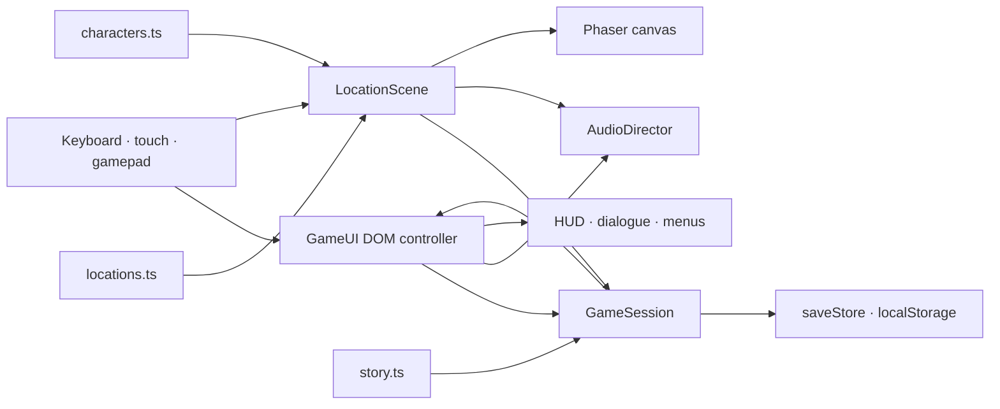

# Busy Day at the Viv V2 — Architecture

**Status:** implementation-aligned snapshot, 2026-07-14
**Runtime:** Vite 8 · TypeScript 6 (strict) · Phaser 3.90 · DOM/CSS interface

## Design priorities

The V2 codebase keeps the story and content definitions replaceable without returning to V1's single large HTML/script file. Authoritative run state lives in one service; Phaser owns the world canvas; the DOM owns menus, dialogue, accessibility presentation, and touch input. Location, character, objective, and save definitions are typed and validated before a shift starts.

The implementation deliberately uses a single generic `LocationScene` for all ten areas. Adding a room usually means adding data and art rather than copying scene logic.



## Startup and scene lifecycle

`src/main.ts` is the composition root. It creates one 1280×720 Phaser game using FIT scaling, four active input pointers, gamepad input, and a 60 fps target.

The registered scene order is:

1. `BootScene` runs `validateWorldGraph()`. Invalid spawns, exits, objective targets, or duplicate IDs stop startup with a readable error.
2. `PreloadScene` shows DOM loading progress and eagerly loads 11 generated images: six browser-sized WebP files for the title, Tea Room, facility hub, Pig Housing, car park, and cath lab, plus five source-sized PNG files for Feed Store, Sheep & Scales, Baboon Wing, Procedure Prep, and Coffee Shop. A required-image failure stops scene startup.
3. `TitleScene` renders the generated title backplate and hands menus to `GameUI`.
4. `LocationScene` renders any current location from `RunState`, including backdrop, obstacles, interactions, NPCs, character, collision, movement, hazards, exits, and music.
5. `UIScene` refreshes the DOM HUD at 10 Hz while the location scene is active.
6. `EndingScene` is registered as an ending surface; the current completion path presents the DOM ending from `LocationScene` after final dialogue.

Scene transitions update `GameSession` first, then restart `LocationScene` at a named destination spawn. A transition lock and 750 ms entry cooldown prevent held movement from immediately bouncing through a reciprocal exit.

## Data model

### Locations

`src/data/locations.ts` exports one `LocationDefinition` per `LocationId`. Each definition contains:

- stable location ID, display name, theme, music cue, optional generated background key;
- a rectangular walkable bound;
- named spawn points with facing;
- exit rectangles with destination location/spawn and optional required flag;
- rectangular fixed obstacles;
- interactions with verb, radius, hold duration, prerequisite, response, and prop type;
- NPC placement, identity, role, line, and visual ID;
- perspective interpolation values.

`validateWorldGraph()` checks duplicate spawn/interaction/objective IDs, spawn bounds and collision occupancy, exit destinations, destination spawns, reciprocal routes, existence of objective locations, and existence of objective interaction IDs. It does not automatically prove that an objective target is in its declared room, that prerequisite flags are ordered, or that whole-room paths are reachable. A separate story audit confirmed all 15 objectives target the declared room and every required flag is granted earlier.

After final-art geometry alignment, a radius-22, 5-pixel-grid audit passed every spawn, target, and exit in the five revised rooms. Reachable components were Feed Store 10,644 cells, Sheep & Scales 9,971, Baboon Wing 12,369, Procedure Prep 14,321, and Coffee Shop 13,348. The Feed Store's optional `dinosaur_toy` hotspot was moved before the passing result because its previous position was unreachable. This is a static geometry result, not the still-pending browser movement/visual rerun.

### Story and objectives

`src/data/story.ts` defines the ordered 15-objective route. An `ObjectiveDefinition` supplies its act, copy, hint, target IDs, rewards, granted flags, kit labels, and checkpoint status. `GameSession.interact()` is the authoritative objective reducer: it enforces interaction prerequisites, records a target once, grants rewards/flags, advances the objective, updates level, and finishes the profile.

Dialogue content is represented as short `DialogueLine` arrays. Choices carry a small typed effect vocabulary (`wayneDown`, `wayneUp`, or `stressDown`) that `GameUI` applies. Most NPC lines are currently single unconditional lines stored with the location.

### Characters

`src/data/characters.ts` separates `CharacterDefinition` gameplay statistics from `CharacterVisualDefinition`. Mel and Josh have independent movement, sprint, stamina, interaction, carrying, and stress values. All named visuals are keyed independently from gameplay logic.

`CharacterRig` currently draws a palette-driven vector paper doll from Phaser graphics. It redraws the silhouette, workwear, face, hair style, glasses, and facial hair for toward/away/side directions and animates idle breathing, walk bob/swing, interaction, hit response, perspective scale, and Y-based depth. A future sprite-atlas renderer can consume the same visual IDs, but atlas paths/frame maps are not yet part of the definition.

## Runtime state and persistence

`GameSession` owns the active `RunState`, settings, and profile. Other systems request transitions, interactions, meter updates, failures, retries, settings changes, and resets through its methods instead of mutating browser globals.

The development/test build exposes a frozen `window.__busyDayTest` adapter for controlled E2E state inspection, objective-room travel, target completion, and physical exit approach. Production builds do not create it.

`src/state/saveStore.ts` serializes one `SaveEnvelope` to `busy_day_at_the_viv_v2_save`:

```text
schemaVersion: 2
settings: audio · dialogue · motion · contrast · subtitles · text · handedness · relaxed
profile: best rank · best coins · completed runs
activeRun: lead · location/spawn/position · objective/targets/flags · meters · rewards · checkpoint · failure
```

Parsing treats browser data as untrusted. It clamps numeric values, verifies lead/location/spawn shape, derives the coherent completed-objective prefix, targets, flags, rewards, level, and checkpoint from the objective index, supplies setting defaults, and discards structurally incomplete active runs. A legacy-shaped envelope is normalized into schema 2; there is not yet a table of explicit per-version migration functions.

`GameSession` persists on new game, objective interactions, transitions, settings changes, failure, retry, reset, a 1.2-second movement interval, and page backgrounding. The interval avoids a local-storage write on every rendered frame while keeping refresh recovery close to the current position.

## Movement, collision, and presentation

`moveCircle()` in `src/systems/collision.ts` is a framework-independent kinematic resolver. It divides a movement delta into steps of at most seven world units, keeps a radius-20 footprint inside location bounds, rejects expanded obstacle rectangles, and resolves X/Y separately to permit wall sliding. Dodge uses the same resolver, preventing a 74-unit dodge from tunnelling through authored barriers.

This is direct-input movement, not pathfinding. The implementation has no navmesh, A*, pointer-to-walk, polygon collision, or carried-object footprint. The pig trolley state applies the selected lead's carrying speed factor; it does not attach a separate physical body to the player.

Every current location definition has a generated `backgroundKey`. Six runtime images are 1280×720 WebP files; the five final-room backplates are currently 1672×941 PNG files displayed at 1280×720. `BackdropRenderer` retains deterministic procedural drawing as a fallback for a definition without a background key, but that fallback is not the production presentation for the ten current locations. Interactions, animals, cars, props, NPCs, and the player remain runtime Phaser objects. Perspective scale interpolates from location far/near values, and object depth is based primarily on Y. Dedicated foreground occlusion images are not implemented.

Feed Store, Sheep & Scales, Baboon Wing, Procedure Prep, and Coffee Shop collision/exit geometry was revised with their final backplates to follow visible doors, counters, cages, scales, rails, carts, and other fixtures. That data/art alignment was authored and the five images were visually inspected, but the final integrated browser collision/visual rerun remains pending.

## UI and input ownership

`src/ui/GameUI.ts` owns all HTML overlays declared in `index.html`:

- title/lead selection and Continue;
- HUD and condition meters;
- objective list, kit flags, and hint;
- range prompt and hold progress;
- dialogue, typewriter reveal, and choices;
- pause, settings, confirmation, failure, and ending;
- touch joystick/actions, captions, toasts, and portrait orientation prompt.

`GameUI` is the single world-input aggregator for touch, DOM keyboard, and polled gamepad state and exposes an `InputSnapshot` to `LocationScene`. Blocking overlays clear held keyboard/touch state and pause/resume the location scene through a reason set, avoiding nested-menu resume and stuck-key bugs. Gamepad polling does not currently provide menu focus or dialogue advancement, so a complete controller-only path is not claimed.

The layout uses CSS safe-area variables, dynamic viewport units, visible focus styles, minimum touch controls larger than 44 CSS pixels, a coarse-pointer layout, and a portrait media query. Settings become body classes for large text, contrast, reduced motion, and handedness.

## Audio

`AudioDirector` has two user-facing gain categories: music and SFX. Six loop IDs map to original WAV beds and 20 one-shot cues map to UI, interactions, animals, machinery, transitions, and hazards. It uses `HTMLAudioElement`, waits for an activation event, crossfades music, ducks it under dialogue/pause, and reapplies saved volume/mute settings.

Music is requested by location rather than predecoded at boot. One-shots are instantiated when used. There are no separate ambience/UI buses, spatial panning, or compressed Opus mirrors yet. Audio paths use `import.meta.env.BASE_URL`, and Vite rewrites the processed CSS title URL for relative/subpath builds.

## Asset pipeline

- Generated PNG masters: `art/generated-masters/`
- Runtime WebP and PNG backplates: `public/assets/backgrounds/`
- Deterministic audio generator: `scripts/generate_audio.py`
- Audio verifier: `scripts/verify_audio.py`
- WebP export: `scripts/optimize_art.mjs`
- Per-file provenance: `docs/ASSET_MANIFEST.md` and `docs/AUDIO_MANIFEST.md`

`scripts/optimize_art.mjs` maps all 11 masters to centre-cropped 1280×720 WebP outputs at quality 88 / effort 5. The original six exports exist. The five final-room conversions could not be run because the platform execution quota refused further elevated Node commands, so their production definitions still load byte-identical 1672×941 PNG copies. Those five files add 12,006,717 bytes (11.450 MiB) to the eager image set. Replacing any generated room that changes doors, fixtures, or obstacle silhouettes also requires updating the corresponding `LocationDefinition` geometry.

## Testing boundaries

Vitest runs in Node and covers collision, world validation, save parsing/persistence, objective progression, failure/checkpoint rollback, transitions, and data-driven completion. Playwright is configured for Chromium, Firefox, and WebKit with a Vite development server at port 4174. Before the five final backplates and matching geometry were integrated, the seven-test suite passed in all three engines (21/21 total), covering title/Josh/New Shift/typewriter dialogue, save/Continue, a room-correct test-assisted full story, three real reciprocal transition directions with post-restart keyboard movement, health failure/retry, portrait/landscape state preservation with landscape touch controls, scroll lock, and seven landscape sizes. A final-art integrated visual/cross-browser rerun remains required; attempts to run the elevated Node/Playwright commands were refused by the platform execution quota rather than producing a test result.

A copied publishable source tree from the earlier six-art snapshot passed `npm ci`, typecheck, lint, all 27 unit tests, and `npm run build`. Its `dist/` passed a local Chromium preview smoke at `127.0.0.1:4180`, including title/New Shift/HUD/Tea Room, one canvas, scroll position 0/0, 12 initial resources, no bad HTTP responses, and no captured console/page errors. This evidence predates the five final PNGs and cannot verify the current eager image payload, a published static-host subpath, or a physical mobile device.

A pre-final-art foreground 1366×768 Chromium automation sample on Intel UHD 620/D3D11 measured a 47.4 FPS blank-page baseline with 18.1 ms p95 frame time and 33.3 FPS active Tea Room play with 36.1 ms p95. A prior same-condition active sample reported 13.5 MiB JavaScript heap. Initial local production navigation measured 1.141 seconds, 12 resources, and approximately 2.95 MB encoded transfer. The five new PNGs make those transfer/performance figures non-representative of the current payload. They remain diagnostic desktop history, not current-build or representative-phone guarantees.

The validator and unit suite establish data integrity but do not replace a real no-shortcut playthrough. Runtime exit approach, visual layering, touch ergonomics, audio lifecycle, and performance require browser/manual evidence.

## Safe extension workflows

### Add a location

1. Add its ID to `LocationId`.
2. Add a complete `LocationDefinition`, named spawns, reciprocal exits, obstacles, interactions, NPCs, theme, and perspective.
3. If it uses a generated backplate, add a preload key and `backgroundKey` union member.
4. Add objective references only after interaction IDs exist.
5. Run typecheck, world-validator unit tests, build, reciprocal-exit E2E, and a visual collision pass.

### Replace character rendering

Keep stable visual IDs and gameplay stats. Extend `CharacterVisualDefinition` with atlas/portrait metadata, implement the renderer in `CharacterRig`, and leave objective/location logic untouched. Verify all four directions, perspective scale, collision footprint, and dialogue identity.

### Replace art or audio

Preserve runtime keys/filenames where possible, regenerate optimized outputs, and update the relevant manifest with source, method, dimensions/duration, format, licence, and replacement constraints. Then run missing-file checks, browser loading, and visual/listening QA.
