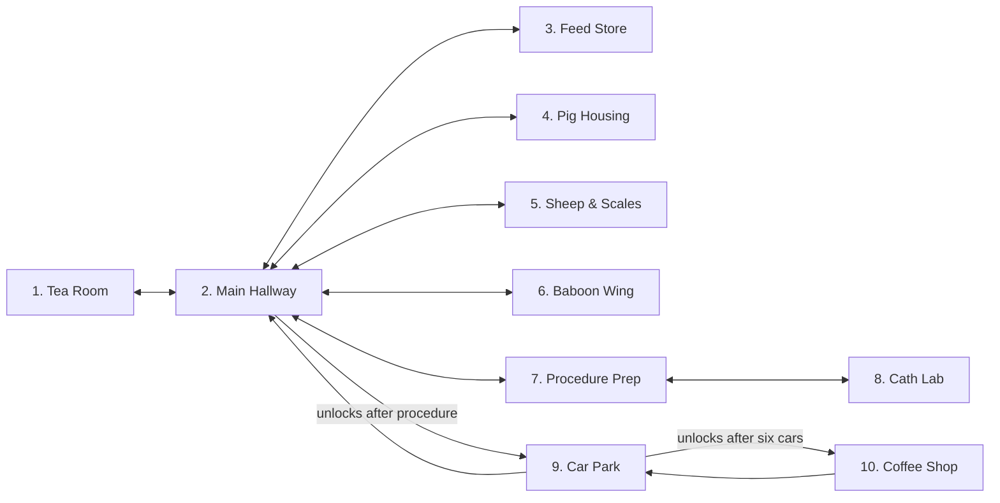

# Busy Day at the Viv V2 — Implemented Game Design

**Document status:** implementation-aligned design, 2026-07-15
**Playable scope:** ten locations · eighteen objectives · two leads · one main ending
**Evidence:** current `src/`, `public/assets/`, `index.html`, tests, and the factual V1/reference audits

This document describes the game that is actually implemented. Earlier ideas that did not make the current build are listed as deferred scope, not presented as features.

## Product statement

`Busy Day at the Viv V2` is a short story-led, top-down 2.5D adventure about completing an implausibly overloaded animal-research shift safely. The player explores a connected facility, cares for pigs, sheep, and baboons, prepares and transports a pig for an abstracted cardiac procedure, handles a sheep-shearing surprise, negotiates a car-park catastrophe, and reaches the coffee Juan promised at 06:45.

The tone is competent people facing impossible logistics. Animal care is calm and abstracted; humour comes from schedules, trolleys, corridor politics, Wayne's blue car, Ross's “quick question”, and Thanh's interpretation of lane discipline.

## V1 identity retained

The implemented V2 preserves the verified V1 spine:

- **Mel** and **Josh** are selectable leads with different movement, stamina, carrying, stress, and interaction characteristics.
- **Sally** starts the day with the shift board; **Juan** promises the final coffee.
- The main sequence remains board, feed cart, individual pig/sheep/baboon feeds, three baboon samples, pig preparation and anaesthesia with Alan, trolley loading, weighing, cath delivery/support, sheep shearing, six car-park actions, and coffee.
- Ross is a corridor-conversation hazard, Wayne's anger is a visible failure meter, and Thanh is a moving car-park hazard with a captioned “HONK.”
- Health and Wayne pressure provide two setback states. Checkpoint retry, restart, XP, coins, levels, and S–D ending ranks remain.
- V1's dry workplace fatalism is retained in dialogue and optional prop inspections.

`Busy_Day_v1.html` remains the historical game. V2 does not reuse V1's monolithic runtime or alter its file.

## Creative and visual direction

The shared aesthetic is an original retro-noir animal facility: high three-quarter views, deep shadows, teal/magenta/amber practical lighting, worn industrial surfaces, rainy reflections, dramatic vignettes, and concise diegetic humour. It takes broad era/genre inspiration without reproducing protected characters, logos, or compositions.

The current build combines:

- 11 generated 3D-rendered backplates: the title plus all ten gameplay locations;
- 11 browser-sized 1280×720 WebP runtime images totaling 1,777,598 bytes (1.695 MiB), with fourteen environment masters retained for revision;
- eight generated 384×384 WebP portraits for the principal speaking cast, cropped from one retained 2048×1024 master;
- one retained Mel/Josh directional character source sheet for possible future atlas production; it is not a packed or runtime-loaded sprite atlas;
- data-driven animated vector characters plus runtime animals, vehicles, props, markers, patrols, and ambient motion;
- perspective scale and Y-based depth so actors become larger toward the foreground;
- generated art used as backplates only, without placing unedited reference photographs in the game.

Reference likenesses, locations, and style were used under the caveats in `ASSET_MANIFEST.md`; publication permission is a separate release requirement.

## Player characters

| Lead | Implemented identity | Play difference |
| --- | --- | --- |
| Mel | Rapid multitasker | 220 walk / 330 sprint; 100 stamina; fastest interaction rate; 0.9 trolley carry factor |
| Josh | Solid procedure support | 196 walk / 292 sprint; 118 stamina; steadier 1.2 trolley carry factor; greater stress resistance |

Both leads use the same story route. The production vector-paper-doll mode redraws workwear, face, hair, glasses/facial hair, and silhouette for toward/away/side directions and supports idle breathing, walk bob/limb swing, interaction motion, hit reaction, perspective scale, and depth. Renderer mode, images/atlases, frame layout, named animation timing, collision footprint, portrait expressions, and voice metadata are all replaceable data; gameplay logic does not own those details.

## World map

V2 has ten connected playable locations. The compact map keeps every room purposeful and merges transition-only rooms from the initial 16-screen proposal.

| # | Location | Gameplay/narrative purpose | Visual implementation | Required route |
| ---: | --- | --- | --- | --- |
| 1 | Tea Room | Opening dialogue, Sally's board, Juan's promise, optional kettle/early-coffee jokes | Generated tea-room backplate | Shift board |
| 2 | Main Hallway | Navigation hub, route-console reset, Ross trap, facility map, staff reactions, locked car-park gate | Generated facility-hub backplate | Revisited throughout |
| 3 | Feed Store | Collect feed cart; inspect suspicious bin and enrichment ball | Generated feed-store backplate | Feed cart |
| 4 | Pig Housing | Feed three pigs individually; meet Luther | Generated pig-housing backplate | Three feeds |
| 5 | Sheep & Scales | Feed three sheep, later weigh the pig and shear a sheep | Generated livestock-scale backplate | Five task interactions across acts |
| 6 | Baboon Wing | Feed three baboons, calibrate the interlock, then collect three samples | Generated secured-animal-wing backplate | Seven task interactions |
| 7 | Procedure Prep | Pig preparation, anaesthesia support, trolley loading with Alan/Luther | Generated procedure-prep backplate | Three staged interactions |
| 8 | Cath Lab | Trolley handover, monitor synchronisation, and cardiac support with cath/engineering teams | Generated cath-lab backplate | Three staged interactions |
| 9 | Car Park | Six vehicle actions, Wayne choice, rising Wayne pressure, Thanh hazard | Generated rainy car-park backplate | All six cars |
| 10 | Coffee Shop | Final Juan conversation, coffee payoff, rank/results | Generated rainy coffee-shop backplate | Coffee ending |

Every exit targets a named spawn in the destination. Main Hall → Car Park requires `procedureComplete`; Procedure Prep → Cath Lab requires `hasTrolley`; Car Park → Coffee Shop requires `carParkClear`.

After the final backplates were integrated, collision/exit geometry was realigned to visible fixtures. The reproducible grid validator now proves collision-safe approach paths for every spawn, objective, NPC, and exit, and found/fixed Vu’s unreachable Feed Store position. Integrated all-room visual QA supplements that static evidence. Chromium then crossed all 18 authored exit directions with real movement after collision-valid approach setup, asserting named spawn, facing, and no post-release drift; a focused reciprocal route also passes Chromium, Firefox, and WebKit.

## Story and objective route

The story uses 18 ordered objectives and 31 targets across six acts. Three V2-only complications materially extend V1’s route: the facility route reset, baboon interlock calibration, and cath-monitor synchronisation. Each objective has a destination, target IDs, rewards, hint, optional kit label, granted flags, and checkpoint status.

| Act | Objective | Targets | Important state/result |
| ---: | --- | ---: | --- |
| 0 | Check the shift board | 1 | Grants `boardChecked` |
| 0 | Restore the morning routes | 1 | Requires board; grants `routesRestored` |
| 0 | Collect the feed cart | 1 | Grants `hasFeedCart`; checkpoint |
| 1 | Feed each pig | 3 | Individual pen cadence |
| 1 | Feed each sheep | 3 | Individual pen cadence |
| 1 | Feed each baboon | 3 | Feed-cart prerequisite; grants `baboonsFed` |
| 1 | Calibrate the wing interlock | 1 | Requires feeds; grants `wingSecured` |
| 1 | Collect three glucose samples | 3 | Grants `hasSamples`; checkpoint |
| 2 | Complete pig preparation | 1 | Grants `pigPrepared` |
| 2 | Assist Alan with anaesthesia | 1 | Requires prep; grants `pigReady` |
| 2 | Load the pig trolley | 1 | Grants `hasTrolley`; checkpoint |
| 3 | Weigh the pig | 1 | Requires trolley; grants `pigWeighed` |
| 3 | Deliver the trolley to cath | 1 | Requires weight; grants `pigDelivered` |
| 3 | Synchronise the monitor bank | 1 | Requires handover; grants `monitorSynced` |
| 3 | Support the cardiac procedure | 1 | Requires monitor sync; grants `procedureComplete`; checkpoint |
| 4 | Shear the afternoon sheep | 1 | Requires procedure completion |
| 4 | Clear the car park | 6 | Grants `carParkClear`; checkpoint |
| 5 | Meet Juan for coffee | 1 | Grants `coffeeEarned`; completes run/profile |

Opening and objective-transition dialogues break the story into short beats. NPCs in each room have compact contextual lines. Optional interactions deliver prop humour without changing the critical path.

## Moment-to-moment play

1. Read the current objective in the HUD or objective drawer.
2. Navigate a constrained room with direct movement.
3. Approach the glowing prop, animal, vehicle, or character.
4. Hold the contextual action until its visible progress completes.
5. Receive prop animation, sound, toast/dialogue, reward, flag, and objective feedback.
6. Use a readable exit to continue from the reciprocal entrance.

The objective drawer lists all 18 tasks, marks completed/current items, displays current kit flags, and reveals one authored hint on request.

## Movement, collision, perspective, and exits

- Eight-direction input is normalized to prevent faster diagonal movement.
- Sprint consumes stamina; normal movement restores it.
- Dodge moves 74 world units through the same collision resolver and costs stamina.
- Mel/Josh statistics alter movement and hold duration. A carried trolley applies a lead-specific speed multiplier.
- Each lead’s authored collision footprint is kept inside the room's walkable rectangle and outside expanded fixed-obstacle rectangles. All six cars are active obstacles until their interaction completes, then the corresponding prop/collider is removed.
- Authored acceleration/deceleration smooths keyboard, touch, and gamepad direction changes; collision response feeds the actual resolved velocity back into animation.
- Movement is divided into steps of at most seven world units; X/Y are resolved separately for wall sliding and reduced tunnelling.
- Character scale interpolates between each room's far/near values; depth follows Y.
- Exit rectangles trigger only when no interaction is active. Locked exits show a reason.
- A 750 ms entry cooldown, transition lock, sound, and fade prevent accidental repeated transitions.
- Reduced Motion converts the fade to an immediate transition.

Pointer/tap destination movement, pathfinding, polygonal nav regions, and separate carried-object collision are not part of the current implementation. Mobile uses the consistent virtual joystick instead. Authored foreground crops now re-layer generated-background fixtures over actors, and seven NPCs follow short collision-safe patrols with proximity reactions.

## Characters and world life

The data set contains visual definitions for Mel, Josh, Sally, Juan, Alan, Ross, Wayne, Thanh, Xing, Anugra, Luther, Tony, Vu, Urja, Dhanya, Poonam, Max, Leila, Erin, Sam, Mitch, James, Eddy, and Pierre. Shinya reuses a current visual palette entry.

NPCs use idle breathing/bobbing, readable nameplates, data-driven awareness/reactions, and seven short authored patrol routes. Pigs, sheep, baboons, coffee steam, markers, and selected props have looping motion. Successful animal interactions layer the species-specific pig/sheep/baboon cue with the task cue. Thanh's vehicle traverses the car-park foreground, reverses at its lane ends, flashes a beacon, sounds a periodic horn, and damages health/stress/Wayne pressure on contact.

Ross triggers after the player remains close in Main Hall. He raises stress and temporarily blocks movement; Dodge releases the trap. He triggers once per Main Hall scene instance rather than following a persistent schedule.

## Dialogue and interaction

Dialogue supports speaker, rendered portrait or accessible initials fallback, expression state, multiline wrapping, typewriter, reveal-all, advance, queueing, and pointer/touch/button/number-key choices. Eight principal speakers use generated retro-noir portraits; the wider ensemble keeps an intentional gradient fallback. The Wayne branch either reduces Wayne/stress or raises both while still moving his car, so choice flavour cannot block completion. Gamepad focus, advancement, choices, accept and back are implemented; a synthetic Chromium path covers the opening conversation, while physical controller/browser validation remains open.

The interaction vocabulary represented in types is Talk, Inspect, Use, Pick up, Open, Operate, Give, Enter, and Exit. Current world targets primarily use Talk, Inspect, Use, Pick up, Operate, and Give; doors/exits are proximity-triggered.

Out-of-order targets return prerequisite or dry contextual feedback. Completed targets cannot grant rewards twice. Optional props return authored lines without affecting progression.

## Pressure, failure, recovery, and ending

- Health ranges from 0–100. Thanh impacts cause 22 damage in standard play and 10 in Relaxed Shift.
- Stamina ranges to the selected lead's maximum and drives sprint/dodge availability.
- Stress records sprint/hazard/Ross/choice pressure and influences final rank.
- Wayne pressure is shown in/around the car-park act. It rises over time while clearing cars, changes through dialogue, and fails at 100.
- Health zero or Wayne 100 produces a setback screen with Retry checkpoint, Restart shift, and Title.
- Retry checkpoint removes post-checkpoint targets/objectives/flags/rewards, recalculates level, restores an authored act spawn, clears failure, restores health/stamina, and caps stress/Wayne to recoverable values.
- Finishing the coffee target records a completed profile run and displays S–D rank, tasks, coins, lead, elapsed in-game minutes, health, and stress.

Rank is a deterministic score from story completion, health, stress, Wayne pressure, and coins. Level increases automatically at XP thresholds; there is no current rank-up choice screen.

## Saving and settings

V2 uses local storage key `busy_day_at_the_viv_v2_save` and schema version 3. Schema-two saves are migrated by stable objective IDs across the three inserted complications. It stores:

- active lead, Relaxed Shift, location/spawn/position/facing;
- objective index, targets, completed objectives, flags, meters, XP, coins, level, checkpoint, failure, and finish state;
- best rank, best coins, and completed-run count;
- music/SFX volume, mute, typewriter, reduced motion, high contrast, captions, text size, touch handedness, and Relaxed Shift default.

The parser clamps and validates untrusted values and safely drops a structurally unusable run. Continue is available only for an unfinished run. Reset All requires confirmation and affects only the V2 key.

Position is persisted on state changes, page backgrounding, and a throttled 1.2-second movement interval so refresh recovery remains close to the current location without writing on every frame.

## Desktop, touch, gamepad, and accessibility

Desktop supports WASD/arrows, Shift sprint, E interaction, Space dodge, O objectives, P/Escape pause, M mute, and Enter/Space/E dialogue advance. Touch provides a virtual joystick plus Sprint, Dodge, contextual Use, HUD objective, and pause buttons. The gamepad world path maps left stick and three face buttons; D-pad/stick focus, accept, back and Start/pause also cover title, dialogue/choices, settings, objectives, pause/confirmation, failure and ending overlays.

The page uses landscape-first FIT scaling, safe-area insets, responsive browser scaling, no-scroll/no-gesture CSS, coarse-pointer layouts, pointer capture/cancel cleanup, and a portrait orientation overlay that pauses the location scene while preserving state. High-DPI output quality remains part of device validation.

Settings include music/SFX/mute, typewriter, reduced motion, high contrast, sound captions, normal/large text, right/left-handed touch, and Relaxed Shift. Important car-park warnings are visible captions/toasts rather than audio-only cues.

Implementation does not substitute for validation: automated representative viewport, touch, longest-dialogue and synthetic-gamepad coverage exists, while real-device touch, hardware-gamepad, screen-reader and broader browser/device matrices remain tracked in the checklist.

## Audio design

Six original mono synthesized WAV loops define the arc:

- `title_noir.wav` — title/noir identity
- `facility_pulse.wav` — social/storage/prep/hall exploration
- `animal_wing.wav` — pig/sheep/baboon rooms
- `cath_tension.wav` — Cath Lab
- `rain_carpark.wav` — Car Park
- `coffee_finale.wav` — Coffee Shop/ending

Twenty one-shots are generated and used for UI, interactions, doors, feed, samples, objectives, success/failure, horn, three animals, footsteps, machinery, coffee, and transitions. Successful pig/sheep/baboon interactions play the relevant species cue at a restrained gain alongside task feedback. Audio waits for activation, loops by location, crossfades music, ducks beneath dialogue/pause, and applies saved music/SFX/mute values.

The pack is deterministic procedural synthesis with no recordings or sample libraries. Full provenance and verification data are in `AUDIO_MANIFEST.md`.

## Performance design

The game uses a fixed 1280×720 logical canvas with Phaser FIT scaling. The title and Tea Room backplates load up front; later rooms load on entry through the typed runtime manifest and a three-location decoded-background LRU. With the title retained, the normal decoded backplate ceiling is roughly four 1280×720 textures instead of eleven. The complete encoded background set is 1,777,598 bytes (1.695 MiB) and benefits from browser HTTP caching. Fourteen environment masters remain outside the runtime path. Music is requested on demand through HTML audio, and one-shot cues are instantiated when played. Scene-owned Phaser objects/tweens are destroyed on scene shutdown by Phaser; local maps are cleared.

For the deployed V2.0 baseline, local strict typecheck, ESLint, 27 unit tests, normal and Pages-path builds passed. The generated URLs were inspected beneath `/busy_day/`, and that deployed host later passed asset and Continue smoke checks. V2.1 PR workflow [`29348227739`](https://github.com/nacho-android/busy_day/actions/runs/29348227739) passed clean release/audio/type/lint/49-unit/build gates plus 48/48 dev-server and 6/6 built-preview tests; physical-device validation remains separate.

That pre-final-art foreground Chromium automation sample at 1366×768 on Intel UHD 620/D3D11 measured 47.4 FPS / 18.1 ms p95 for a blank-page baseline and 33.3 FPS / 36.1 ms p95 in the active Tea Room. A prior same-condition sample reported a 13.5 MiB JavaScript heap. Initial local production navigation measured 1.141 seconds, 12 resources, and approximately 2.95 MB encoded transfer. The art payload has changed since that sample, so current-payload and mid-range-phone frame rate, decoded texture/audio memory, long-session growth, transitions, and hosted latency remain unmeasured.

## Implemented acceptance and deferred scope

Implemented in source/data:

- V1-derived opening-to-coffee state path for both leads;
- ten connected purposeful locations and reciprocal exit definitions;
- collision, perspective, transition locks, interactions, dialogue, objectives, hazards, failures, recovery, save/settings, touch/orientation, original artwork, and original audio;
- strict types, lint, unit tests, and production build.

V2.1 merged through [PR #2](https://github.com/nacho-android/busy_day/pull/2) as [`d5bc627`](https://github.com/nacho-android/busy_day/commit/d5bc627235f70865290b34e8efe28824debb1e54). Node 24 main workflow [`29350906888`](https://github.com/nacho-android/busy_day/actions/runs/29350906888) passed the quality and Chromium, Firefox, and WebKit jobs; [Pages job `87149283383`](https://github.com/nacho-android/busy_day/actions/runs/29350906888/job/87149283383) succeeded. [The hosted build](https://nacho-android.github.io/busy_day/) served `assets/index-DEBHc20z.js` and `assets/index-CyZvj29T.css`; title, New Shift confirmation, opening dialogue, Tea Room objective 0/1, refresh/Continue recovery, and the 18-objective drawer passed with zero captured console entries.

Post-optimization visual QA captured all ten rooms plus the ending without console/page errors. The contact sheet passed HUD, actor/target, exit, texture, and blank-room review; `visual-qa/` remains ignored.

V2.1 adds dev-server coverage for all 18 authored exit directions and higher-risk failure, recovery, settings, touch, barrier, dialogue and controller paths, plus a separate built-preview suite that checks hashed assets, production-only boundaries, real keyboard movement, save/refresh/Continue and request/page/console errors. The final PR matrix passed 16 dev plus two preview tests in each of Chromium, Firefox, and WebKit. A longer public-input Mel/Josh harness also exists outside default CI. The recorded Mel attempt was stopped after shared-host software-WebGL frame starvation prevented a reliable hold interaction at the visible shift-board prompt; Josh was not run, so neither journey is a completion claim.

Still required for a full completion claim:

- complete no-shortcut public-input Mel and Josh execution in a frame-stable environment;
- complete manual runs for Mel and Josh without test shortcuts;
- representative real touch device and gamepad checks;
- complete audio-listening and soak/current-phone performance review beyond the accepted checkpoint captures;
- rights review for likeness-informed artwork.

Deferred rather than silently claimed:

- six additional transition/specialist screens from the initial map;
- Wrong Century side objective/dinosaur gameplay;
- pointer-to-walk and navigation pathfinding;
- physical carried-object bodies and a spatial car puzzle;
- approved directional sprite atlases and dedicated per-expression portrait redraws (the current vector renderer and eight neutral portraits remain replaceable data);
- broader NPC schedules and optional side-objective chains beyond the seven current short patrols and three V2.1 critical-path complications;
- independent ambience/UI gain buses and compressed audio mirrors.

The definitive status and evidence log is `IMPLEMENTATION_CHECKLIST.md`; genuine user-facing limitations are in `KNOWN_LIMITATIONS.md`.
